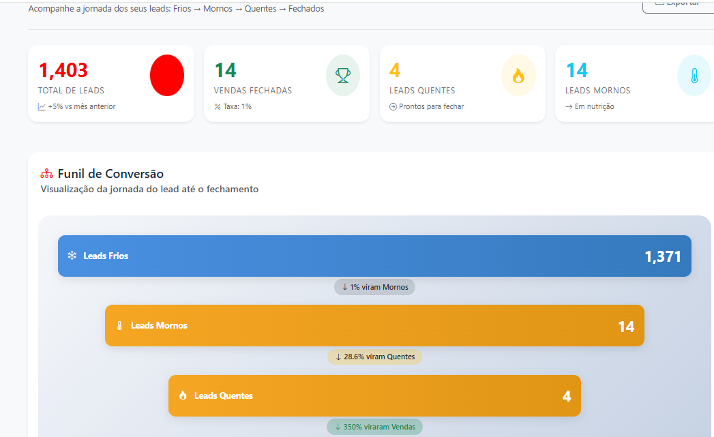

# Operational KPI Dashboard

Dashboard operacional demonstrativo para acompanhamento de indicadores estratégicos e performance operacional.

---

# 📊 Objetivo

Demonstrar uma estrutura moderna de Business Intelligence voltada para:

- KPIs operacionais
- Performance
- SLA
- Produtividade
- Eficiência operacional
- Gestão estratégica

---

# 📌 Indicadores Monitorados

- SLA atendimento
- Produtividade operacional
- Taxa de conversão
- Tempo médio de resposta
- Eficiência operacional
- Volume operacional
- Performance por equipe

---

# 📈 Dashboards

- Dashboard Executivo
- Dashboard Comercial
- Dashboard Operacional
- Dashboard Atendimento

---

# 🛠️ Tecnologias

- Power BI
- SQL
- Excel
- MySQL
- REST API
- ETL

---

# 🎯 Objetivo Estratégico

Demonstrar como dados e indicadores podem apoiar decisões estratégicas e melhorar eficiência operacional.

---

# 📌 Status do Projeto

🚧 Estrutura demonstrativa em evolução

---

# 👨‍💻 Autor

Fábio Viana  
Profissional de TI, CRM, Operações e Transformação Digital.

---

# 📸 Dashboard Preview

